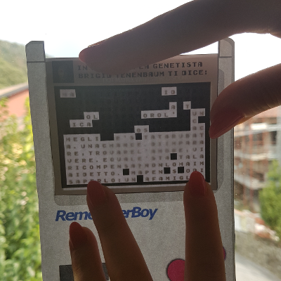

# WordBoy

**WordBoy** can help you on making simple printable puzzles you can use at parties.

    

A WordBoy is a GameBoy-shaped grid of letters...

    

...and up to 4 cartriges, with a hint and a black and white grid...

    

The hidden message of each cartrige can be read folding the cartrige, plugging it into the right WordBoy and reading it against the light.

    

The trick is: you can shuffle/hide multiple cartiges and WordBoys, requiring some teamwork and interaction between people in order to solve the puzzles

## Setup

Download this repository and serve the folder with the web server you like. You can customize a lot of stuff from the core file `wordboy.js` and the frontend `index.html`. If you feel creative you can even customize the WordBoy and cartrige layout, modifying the `wordboy.svg` file - I've used the excellent [Inkscape](https://inkscape.org/).

## Fonts

I've used the [Early GameBoy](https://www.dafont.com/early-gameboy.font) for the grid and the hints but you can change it the way you like.

## History

I've coded this program and used WordBoys puzzle in my wedding with Bianca for a short and light escape room game at the restaurant... In which me and my wife were dressed like fictional Japanese madmen - based on the crazy drawings of our nephews.

    

Our purpose was to let all the families interact together. It worked pretty well!
